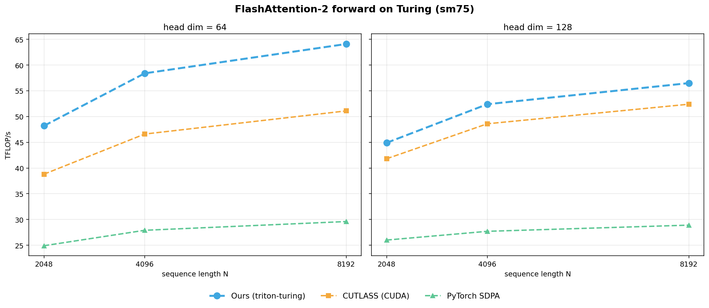
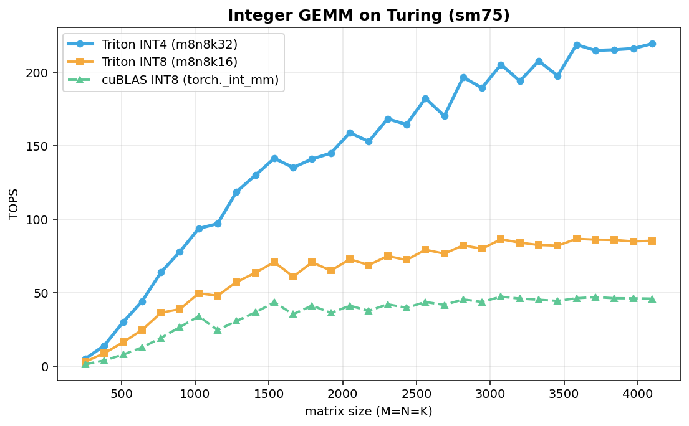
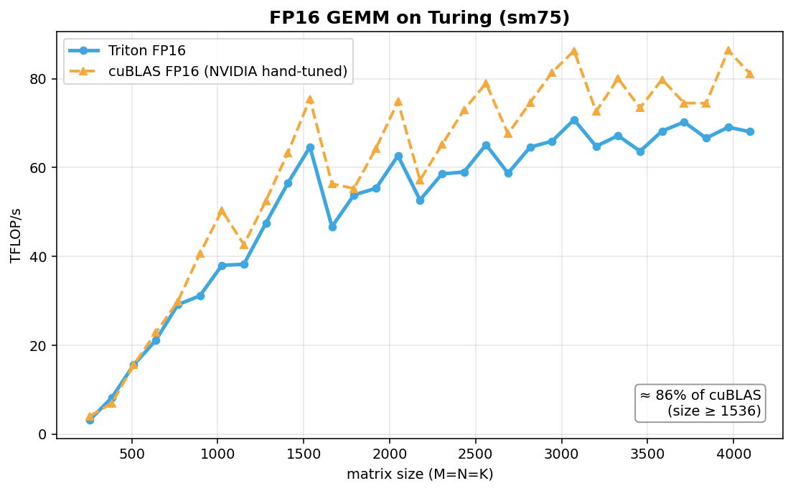
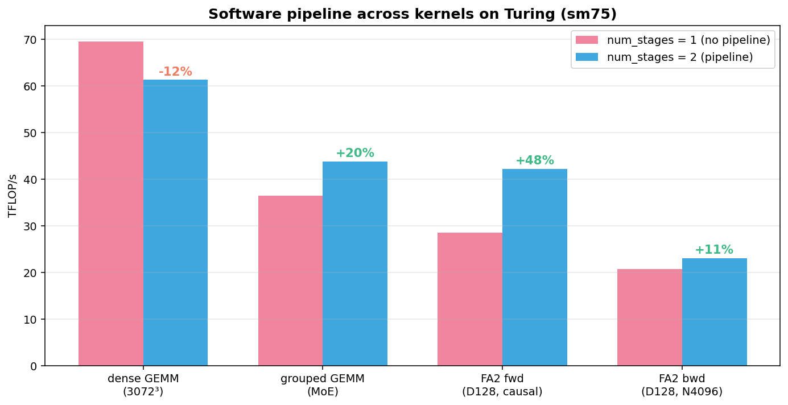

# Triton-Turing

**Triton-Turing** is a community-maintained fork of [Triton](https://github.com/triton-lang/triton) focused on restoring high-performance Tensor Core support for NVIDIA Turing GPUs (SM75: RTX 2080 Ti, Titan RTX).

Upstream Triton supports Turing's MMA instructions, but critical optimizations were gated to SM80+ (Ampere and later). Specifically, the `optimize_dot_operands` pass (which hoists layout conversions before matmul) was disabled for sm75, and the software pipeline exclusively uses `cp.async`, an Ampere-only instruction. As a result, Turing performance degrades significantly compared to its tensor-core potential.

## Goals

1. **Enable layout optimization** — `optimize_dot_operands` pass for sm75 (layout hoisting before MMA)
2. **Software double-buffering without `cp.async`** — implement a `ld.global → st.shared → bar.sync` pipeline path to overlap memory loads with MMA on Turing
3. **Turing-specific autotune** — configs tuned for 64 KB/CTA shared memory and native instruction shapes (fp16: `m16n8k8`, int8: `m8n8k16`)
4. **int4 MMA support** — implement the `m8n8k32` instruction path for int4 precision (hardware-supported but not implemented in upstream Triton)

## Status

| Feature | Status |
|---|---|
| `optimize_dot_operands` pass enabled for sm75 | ✅ Done |
| Software double-buffering (`ld.global + bar.sync` pipeline) — first ever for Turing | ✅ Done |
| Turing-specific autotune configs | ✅ Done |
| int8 GEMM (`m8n8k16`) | ✅ Done |
| int4 MMA (`m8n8k32`) — first usable pure-int4 matmul in Triton | ✅ Done |
| FlashAttention-2 forward + backward (pipelined) | ✅ Done |

## Performance

All numbers below are from a Turing card (Titan RTX / RTX 20-series, sm75). GEMM
curves use a throttle-corrected measurement (large sizes measured cold, best of
3 runs); without a locked clock the very largest sizes are still throttle-prone.
Each operator is compared against the strongest existing implementation in its
domain.

### FlashAttention-2 forward — faster than a hand-written CUDA kernel



The Triton FA2 forward kernel (tutorial `06-fused-attention.py` plus our sm75
pipeline) is the fastest at every size measured — ahead of a from-scratch
CUDA/CUTLASS FlashAttention for Turing by **+7–26%**, and ahead of PyTorch SDPA
(xformers backend) by **1.7–2.2×**. Attention benefits from the pipeline because
the softmax dependency chain leaves the Tensor Cores idle, and the pipeline uses
that window to prefetch K/V.

### Integer GEMM — INT4 doubles INT8, and cuBLAS has no INT4 path



INT4 (`m8n8k32`) reaches **≈ 2× the throughput of INT8** (peak **219 TOPS**),
gaining on both fronts: 2× Tensor Core compute and half the shared-memory
traffic (operands stay packed as `int32`). cuBLAS exposes **no INT4 GEMM at all**
on Turing — this is the first usable pure-int4 matmul in Triton (upstream marks
the path "Not implemented"). Triton INT8 also clears cuBLAS INT8 by ~1.8×.

### FP16 GEMM — matching NVIDIA's hand-tuned cuBLAS



For plain FP16 GEMM the Triton kernel reaches **≈ 84–86 % of cuBLAS** — NVIDIA's
hand-tuned vendor library — across the mid-to-large size range.

### When the software pipeline helps



The sm75 software pipeline (the first ever implemented for Turing) helps
**latency-exposed** kernels — FlashAttention (**+48 %** fwd, **+11 %** bwd) and
grouped/MoE GEMM (**+20 %**) — but not the compute-bound dense GEMM, where the
Tensor Cores are already saturated and load latency is hidden by ILP. Kernels
with no reduction loop to pipeline (layernorm, softmax, elementwise) are not
applicable.

A runnable INT8/INT4 example is in
[`python/tutorials/12-turing-integer-matmul.py`](python/tutorials/12-turing-integer-matmul.py).

## Installation

```shell
git clone <this repo>
cd triton
pip install -r python/requirements.txt
pip install -e .
```

Requires a Turing GPU (sm75) and CUDA 11+. For full build instructions see the [upstream docs](https://triton-lang.org).
