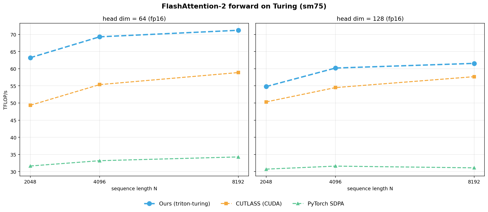
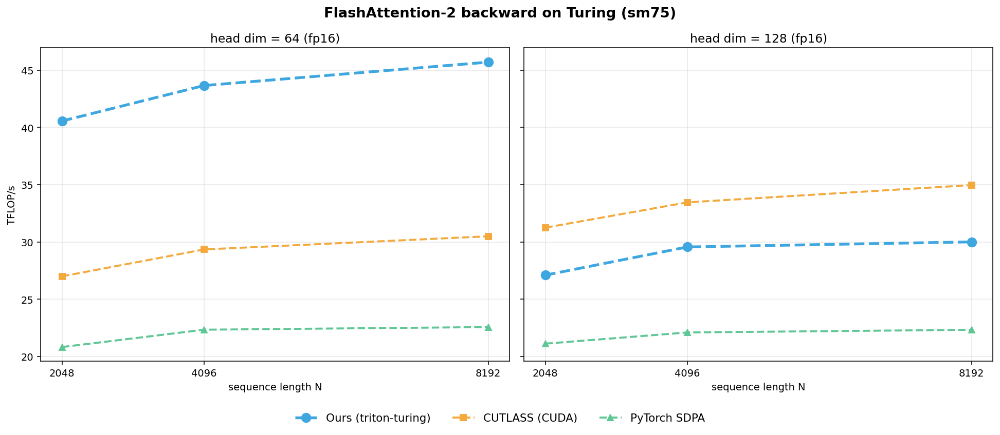
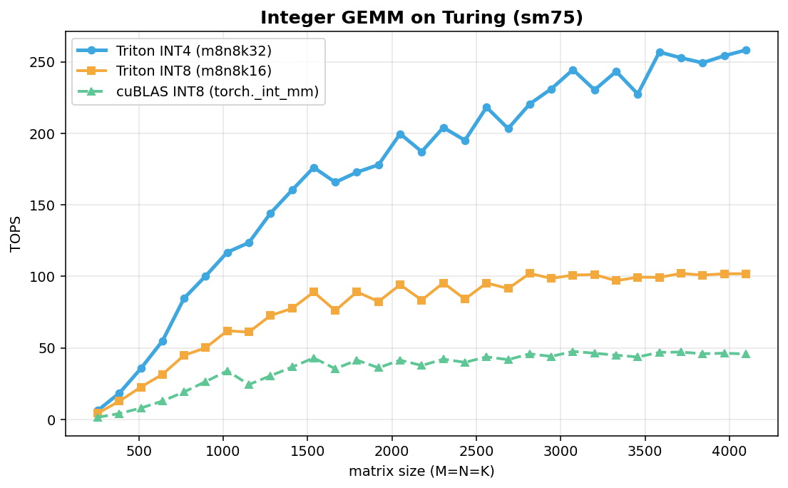
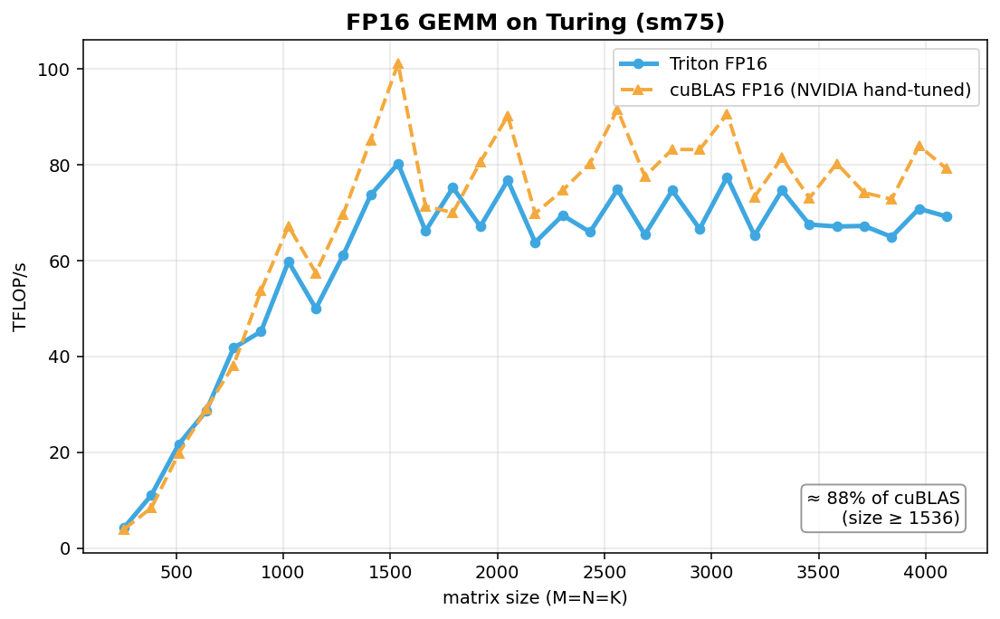
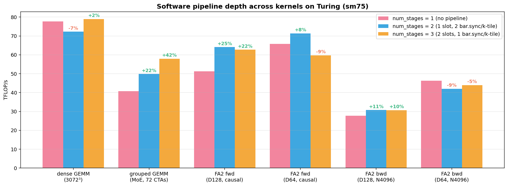

# Triton-Turing

**Triton-Turing** is a community-maintained fork of [Triton](https://github.com/triton-lang/triton) focused on restoring high-performance Tensor Core support for NVIDIA Turing GPUs (SM75: RTX 2080 Ti, Titan RTX).

Upstream Triton supports Turing's MMA instructions, but critical optimizations were gated to SM80+ (Ampere and later) — most importantly the software pipeline, which exclusively uses `cp.async`, an Ampere-only instruction. As a result, Turing performance degrades significantly compared to its tensor-core potential.

## Goals

1. **Software pipelining without `cp.async`** — a multi-stage `ld.global → st.shared → bar.sync` path to overlap memory loads with MMA on Turing (`num_stages` ≥ 2, not just double-buffering)
2. **Turing-specific autotune** — configs tuned for 64 KB/CTA shared memory and native instruction shapes (fp16: `m16n8k8`, int8: `m8n8k16`)
3. **int4 MMA support** — implement the `m8n8k32` instruction path for int4 precision (hardware-supported but not implemented in upstream Triton)

## Status

| Feature | Status |
|---|---|
| Software pipelining (multi-stage `ld.global + bar.sync`) — first ever for Turing | ✅ Done |
| Turing-specific autotune configs | ✅ Done |
| int8 GEMM (`m8n8k16`) | ✅ Done |
| int4 MMA (`m8n8k32`) — first usable pure-int4 matmul in Triton | ✅ Done |
| FlashAttention-2 forward + backward (pipelined) | ✅ Done |

## Performance

All numbers below are from a Titan RTX (sm75). GEMM curves use a
throttle-corrected measurement (large sizes measured cold, best of 3 runs);
without a locked clock the very largest sizes are still throttle-prone. The two
FlashAttention figures come from a single process that measures forward,
backward and all four implementations back to back, so every comparison within
them shares one thermal state. Each operator is compared against the strongest
existing implementation in its domain.

### FlashAttention-2 forward — faster than a hand-written CUDA kernel



The Triton FA2 forward kernel (tutorial `06-fused-attention.py` plus our sm75
pipeline) is the fastest at every size measured — ahead of a from-scratch
CUDA/CUTLASS FlashAttention for Turing by **+21–26%** at head dim 64 and
**+4–8%** at head dim 128, and ahead of PyTorch SDPA (xformers backend) by
**1.7–2.2×**. Attention benefits from the pipeline because the softmax
dependency chain leaves the Tensor Cores idle, and the pipeline uses that window
to prefetch K/V.

An exhaustive sweep of the forward block/stage/warp space found no headroom
left: the autotune list already contains the winner at every size, 256-row
blocks at best tie, and `num_stages=1` is 9–20% slower because the forward is
latency-exposed and genuinely wants the pipeline.

### FlashAttention-2 backward — a mixed result, and our one weakness



Backward is honest about a limitation. At head dim 64 our kernel beats the
CUDA/CUTLASS implementation by **+35–41%** — that margin comes from two
compounding changes: retuning the block sizes for Turing (+6%), and a codegen
change that lets a transposed dot operand read the shared buffer its
untransposed sibling already filled, instead of paying a scratch round trip per
loop iteration (−8–14% kernel time under a locked clock).

At head dim 128 it **trails by 13–16%** — the only place we lose. That
configuration is unchanged: the codegen change above is gated off there, because
the backward kernel compiles at the 255-register ceiling and holding the buffer
live longer tips it into spilling (local memory traffic goes from 15 MB to 688
MB). Upstream's d=128 backward blocks need ~82 KB of shared memory, well past
Turing's hard **64 KB/CTA** limit, so `BLOCK_N1` and `BLOCK_M2` are halved to 64
to fit.

That fallback is not a missed tuning opportunity. An exhaustive sweep of the
block/stage/warp space — 216 configurations, of which 34 fit in 64 KB and only 18
also satisfy the kernel's `BLOCK_N1 == BLOCK_M2` requirement — confirms the
shipped configuration is the fastest one available. Every larger tile that fits
forces `num_stages=1`, and giving up the pipeline costs slightly more than the
larger tile gains: the best alternative lands within 1.7%. Closing the remaining
gap needs a codegen-level shared-memory reduction or a different kernel
structure, not different block sizes. That is future work.

### Integer GEMM — INT4 doubles INT8, and cuBLAS has no INT4 path



INT4 (`m8n8k32`) reaches **≈ 2× the throughput of INT8** (peak **219 TOPS**),
gaining on both fronts: 2× Tensor Core compute and half the shared-memory
traffic (operands stay packed as `int32`). cuBLAS exposes **no INT4 GEMM at all**
on Turing — this is the first usable pure-int4 matmul in Triton (upstream marks
the path "Not implemented"). Triton INT8 also clears cuBLAS INT8 by ~1.8×.

### FP16 GEMM — matching NVIDIA's hand-tuned cuBLAS



For plain FP16 GEMM the Triton kernel reaches **≈ 84–86 % of cuBLAS** — NVIDIA's
hand-tuned vendor library — across the mid-to-large size range. A 108-config
sweep confirms the autotune list is already at that ceiling above 2048; the only
gap it found was near 1 K, where two single-stage configs are worth **+3–4 %**.

Grouped (MoE) GEMM gained **+5–10 %** from the same exercise, almost all of it
from dropping `num_stages` from 3 to 2: at 3 stages a 128×128×32 tile needs
49152 B of shared memory, over the 32 KB that lets two CTAs share a Turing SM,
and the pipeline buys back less than the occupancy it costs.

### When the software pipeline helps



The sm75 software pipeline (the first ever implemented for Turing) helps
**latency-exposed** kernels — FlashAttention (**+48 % fwd / +11 % bwd on head_dim=128**,
**+11 % fwd on head_dim=64**) and grouped/MoE GEMM (**+20 %**) — but not the
compute-bound dense GEMM, where the Tensor Cores are already saturated and load
latency is hidden by ILP. Kernels with no reduction loop to pipeline (layernorm,
softmax, elementwise) are not applicable.

Pipeline depth (`num_stages`) is configurable — not limited to double-buffering —
and autotuned per kernel and size. Turing's small 64 KB/CTA shared memory caps the
useful depth: for the kernels that benefit from pipelining, **`num_stages=2` is the
sweet spot**, because a third stage usually exceeds the budget (it OOMs for
FlashAttention). The compute-bound dense GEMM is the exception — it is fastest with
no pipelining (`num_stages=1`), a third stage edging a few percent ahead only at the
largest 4096³ size.

A runnable INT8/INT4 example is in
[`python/tutorials/12-turing-integer-matmul.py`](python/tutorials/12-turing-integer-matmul.py).

## Installation

```shell
git clone <this repo>
cd triton
pip install -r python/requirements.txt
pip install -e .
```

Requires a Turing GPU (sm75) and CUDA 11+. For full build instructions see the [upstream docs](https://triton-lang.org).
